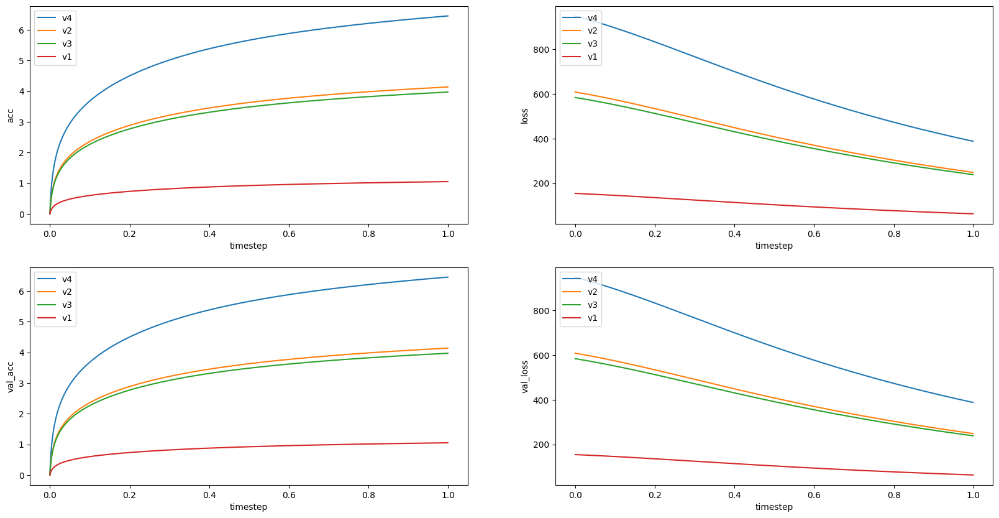
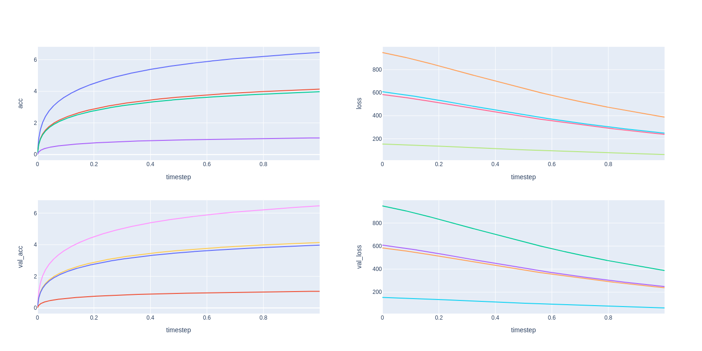
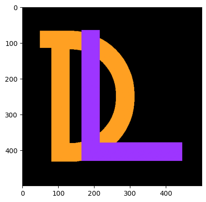
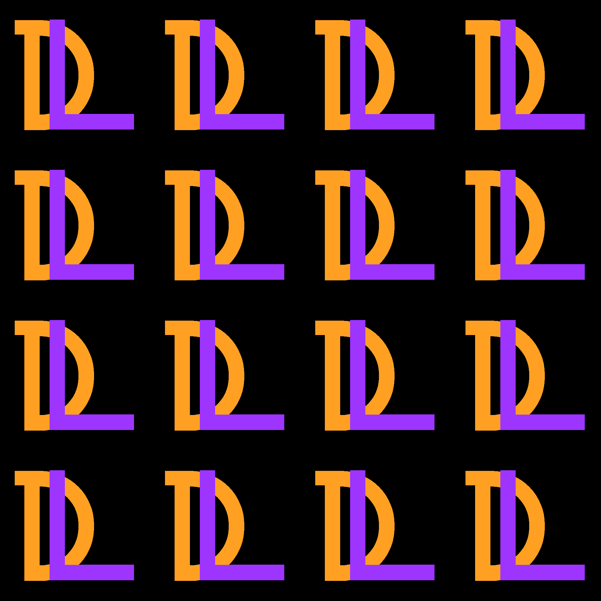
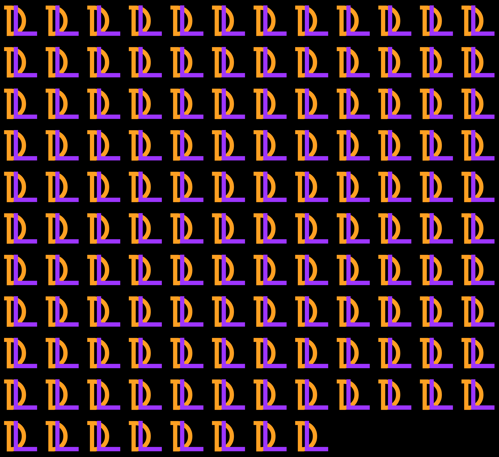

.. image:: ./assets/logodeeplogs.png
   :height: 200
   :align: center
   :alt: DeepLogs Logo

**Simplified Python Logging and Progress Tracking**

DeepLogs, a cutting-edge Python module, revolutionizes the way you handle logging and progress tracking in your projects. Designed for data scientists and developers alike, this powerful tool streamlines data management, ensuring efficiency and simplicity throughout your workflow.

Features
********

1. **Effortless Logging for Data Scientists:** DeepLogs provides an intuitive Logger, enabling data scientists to effortlessly manage and save logs during model training. Say goodbye to manual logging hassles and focus on insights that matter.

2. **Seamless Task Tracking for Everyone:** DeepLogs makes task logging accessible to everyone. From developers to researchers, easily track specific elements within your Python projects without complex setups or steep learning curves.

3. **Dynamic Progress Bar:** Stay informed about your project's progress with DeepLogs' dynamic Bar component. Effortlessly monitor iterators' advancement, enhancing productivity and keeping you in control.

- DeepLogs is designed for efficiency. Its optimized performance ensures minimal impact on your project, while its user-friendly interface simplifies logging and tracking tasks, saving you valuable time and effort.
- No matter the project's complexity or purpose, DeepLogs adapts flawlessly to your Python endeavors. From machine learning models to general Python projects, experience the benefits of streamlined logging.

Installation
************

.. code-block:: bash

    pip install deeplogs

.. code-block:: python

    import deeplogs as dpl

    logger = dpl.Logger("v1")
    bar = dpl.Bar(logger)
    reader = dpl.Reader()
Usage
*****

**This section provides an overview of how to use the 'deeplogs' library.**

Setup & Imports
---------------

Import the library.

.. code-block:: python

    import deeplogs as dpl

You can define a dictionary that contains the configuration of your model.

.. code-block:: python

    model_hyperparam = {
        "version": 4,
        "epoch": 1,
        "batch_size": 128,
        "lr": 1e-3,
        
        "x_shape": (512,512),
        "y_shape": (10,),
        "nb_layers": 8,
    }

The Logger here takes in three arguments:
    - a string containing a run name
    - a description of the run
    - and the configuration dictionary created earlier

.. code-block:: python

    logger = dpl.Logger(
        "v" + str(model_hyperparam["version"]),
        "A description of the run",
        model_hyperparam,
    )

Implementation
--------------

- In this illustrative code, model performance is generated randomly, and the outcomes are meticulously logged.
- During each epoch and batch iteration, the "logs" dictionary is continuously updated with important metrics such as "acc", "loss", "val_acc", and "val_loss".
- These results are subsequently saved using the 'logger.scalar()' method. Finally, we use the flush method to save the latest logs immediately.

.. code-block:: python

    model_perf = random()
    for epoch in range(model_hyperparam["epoch"]):
        size = 1000
        for batch in dpl.Bar(logger, f"Epoch {epoch+1}")(range(size)):
            logs = {}
            
            logs["acc"] = log(batch+1) * model_perf
            logs["loss"] = size/exp((batch+1)/size) * model_perf
            logs["val_acc"] = log(batch+1) * model_perf
            logs["val_loss"] = size/exp((batch+1)/size) * model_perf
            
            timestep = epoch + (batch/size)
            logger.scalar(timestep, **logs)
            
            sleep(0.005)
    logger.flush()
    
>>> Epoch 1: 100%|██████████| 1000/1000 [0:00:05<0:00:00, 196.82it/s] acc: 1.761 | loss: 93.771 | val_acc: 1.761 | val_loss: 93.7711

**That's all you need to integrate into your model's learning loop to get data and monitor your model.**

Results
-------

Scalars
=======

Create the reader

.. code-block:: python

    reader = dpl.Reader()

Display information about the runs.

.. code-block:: python

    reader.infos()

.. list-table::
   :header-rows: 1

   * - name
     - description
     - version
     - epoch
     - batch_size
     - lr
     - x_shape
     - y_shape
     - nb_layers
   * - v1
     - A description of the run
     - 1
     - 1
     - 128
     - 0.001
     - (512, 512)
     - (10,)
     - 8
   * - v2
     - A description of the run
     - 2
     - 1
     - 128
     - 0.001
     - (512, 512)
     - (10,)
     - 8

Display a summary of the metrics used during the training of your model.

.. code-block:: python

    reader.describe()

.. list-table::
   :header-rows: 1

   * - name
     - description
     - acc
     - loss
     - val_acc
     - val_loss
   * - v4
     - count
     - 5000.000000
     - 5000.000000
     - 5000.000000
     - 5000.000000
   * - 
     - mean
     - 1.950368
     - 208.427719
     - 1.950368
     - 208.427719
   * - 
     - std
     - 1.308797
     - 151.283633
     - 1.308797
     - 151.283633
   * - 
     - min
     - 0.000000
     - 40.007505
     - 0.000000
     - 40.007505
   * - 
     - 25%
     - 0.741063
     - 81.293497
     - 0.741063
     - 81.293497
   * - 
     - 50%
     - 1.568038
     - 154.525183
     - 1.568038
     - 154.525183
   * - 
     - 75%
     - 3.333099
     - 308.287299
     - 3.333099
     - 308.287299
   * - 
     - 90%
     - 3.908165
     - 448.516692
     - 3.908165
     - 448.516692
   * - 
     - max
     - 4.343923
     - 628.218730
     - 4.343923
     - 628.218730

Display scalar data using Matplotlib.

.. code-block:: python

    reader.scalar(using="matplotlib")

Display scalar data using Plotly.

.. code-block:: python

    reader.scalar(using="plotly")

Images
======

To demonstrate image handling, we start by opening an example image and converting it into a NumPy array.

.. code-block:: python

    img = np.asarray(Image.open("./assets/logo.png"))[:,:,:3] / 255
    fig = plt.imshow(img)

Next, we perform various transformations on the image to explore its dimensions and formats.

.. code-block:: python

    img1 = img
    img2 = img.transpose(2,0,1)
    img3 = img.transpose(2,0,1)[None].repeat(16,0)
    img4 = img.transpose(2,0,1)[None].repeat(128,0)
    img5 = img[:,:,0]

For the original image, the dimensions are (height, width, color), i.e., (500, 500, 3).

>>> img1.shape (500, 500, 3) # (height, width, color)

o log this image, the "HWC" format should be used.

.. code-block:: python

    logger.image(12, img1, "image1", "HWC")

>>> img2.shape (3, 500, 500) # (color, height, width)

.. code-block:: python

    logger.image(1, img2, "image2", "CHW")

.. image:: ././assets/image2_1.png
    :height: 200
    :alt: Usage Image 2

When multiple images are provided in a batch, the method creates a single grid-like image.

>>> img3.shape (16, 3, 500, 500) # (batch, color, height, width)

.. code-block:: python

    logger.image(0.001, img3, "image3", "NCHW")

To log this batched image, the "NCHW" format is required.

>>> img4.shape (128, 3, 500, 500) # (batch, color, height, width)

.. code-block:: python

    logger.image(0.9, img4, "image4", "NCHW")

Even if the image has no color dimension, the method saves the image as grayscale with dimensions (height, width), i.e., (500, 500)

>>> img5.shape (500, 500) # (height, width)

.. code-block:: python

    logger.image(0., img5, "image5", "HW")

Examples
********
